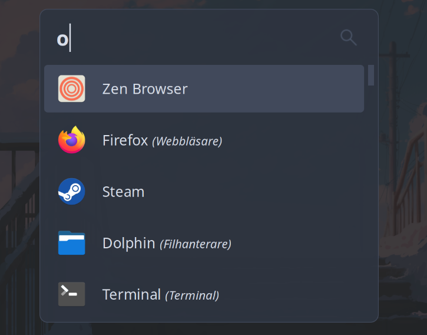
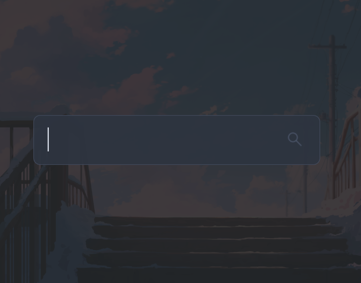

# OutTheme
A minimal rofi theme kinda inspired by Flow Launcher. 

Made for rofi version 2.0.0. Built on KDE Plasma 6 with Wayland (but probably works with other configurations). Uses the Nord Theme colors by Arctic Ice Studio. The repository also contains two search icons (made by me), one white and one matching the nord theme. Of those, only `searchicon_b3.svg` is actually used in the theme. 

I might update it if rofi ever gets better wayland support, right now dynamic scaling is a bit weird.

## Installation

Easiest installation is usually just placing `config.rasi` and `searchicon_b3.svg` in the `~/.config/rofi/` folder on your system.

Also requires Open Sans font installed on the system. To install Open Sans on Debian/Ubuntu: `sudo apt install fonts-open-sans`.

## Preview

